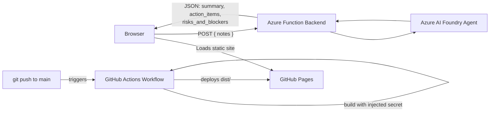

# 🎨 Meeting Notes Analyzer — Frontend

> A React interface for the Meeting Notes Analyzer agent — paste raw meeting notes, get a structured summary, action items, and risks.

**🔗 Live site: https://vedansh2601.github.io/Ai-Meeting-Analyzer-Frontend/**

---

## 📖 About

This is the frontend half of a demonstration pairing a portal-defined Azure AI Foundry Agent with a custom web interface. A user pastes unstructured meeting notes into the app, which sends them to an Azure Function backend. That function calls an AI agent (`ai-notes-analyzer`, built in the Azure AI Foundry portal) which extracts a summary, action items with owners and due dates, and any risks or blockers — all returned as structured JSON and rendered here as a summary card, a sortable-looking task table, and a tagged risk list.

The app was originally designed as a standalone visual prototype, then integrated into this codebase, converted from TypeScript to plain JavaScript, and wired up to the live backend with additional accessibility and interaction polish (an example-fill shortcut, keyboard focus states, reduced-motion support).

---

## ✨ Features

- 📝 Paste-and-analyze workflow — one textarea, one button, structured results
- ⚡ "Try an example" shortcut for quick demos
- 🏷️ Color-coded risk badges (Risk, Blocker, Dependency, Issue)
- 👤 Owner avatars on action items
- ♿ Accessible — keyboard focus states, `role="alert"` on errors, respects `prefers-reduced-motion`
- 📱 Responsive
- 🚀 Auto-deployed via GitHub Actions on every push to `main`
- 🔐 API endpoint injected at build time via a GitHub secret, not stored in the repo

---

## 🏗️ Architecture



| Layer | Technology |
|---|---|
| **Framework** | React 19 + Vite |
| **Styling** | Tailwind CSS v4 |
| **Icons** | lucide-react |
| **Hosting** | GitHub Pages |
| **CI/CD** | GitHub Actions |
| **Backend** | Azure Function + Azure AI Foundry Agent (Managed Identity auth) |

---

## 📁 Project Structure

```
.
├── .github/
│   └── workflows/
│       └── deploy.yml         # GitHub Actions workflow - builds and deploys on push to main
├── public/
│   ├── favicon.svg
│   └── icons.svg
├── src/
│   ├── App.jsx                 # Main component - form, API call, and results rendering
│   ├── index.css                # Tailwind import + custom entrance animation keyframes
│   ├── main.jsx                 # React entry point
│   └── assets/                  # Static images
├── .env.local                   # Local-only env var (VITE_API_URL) - gitignored, not in repo
├── index.html                    # HTML shell, includes Google Fonts links
├── vite.config.js                # Vite config - React + Tailwind plugins, GitHub Pages base path
├── package.json
└── README.md
```

**Key file:** `src/App.jsx` contains the entire UI — the notes input, the API call (`handleAnalyze`), and three result sections (Summary, Action Items table, Risks & Blockers list), each conditionally rendered based on request state (idle / loading / error / success).

---

## 🖥️ Running Locally

**1. Install dependencies**
```bash
npm install
```

**2. Configure the API endpoint**

Create `.env.local` in the project root (gitignored):
```
VITE_API_URL=<your-backend-function-url>
```

**3. Run the dev server**
```bash
npm run dev
```
Opens at `http://localhost:5173`.

---

## 🏗️ Building

```bash
npm run build
```
Outputs to `dist/`. Requires `VITE_API_URL` in the environment.

---

## ☁️ Deployment

Deployed automatically via **GitHub Actions** (`.github/workflows/deploy.yml`) on every push to `main`:
1. Installs dependencies, builds with `VITE_API_URL` injected from a repository secret
2. Publishes `dist/` to GitHub Pages

**One-time setup:**
- `base: '/Ai-Meeting-Analyzer-Frontend/'` set in `vite.config.js`
- Repo **Settings → Pages → Source** set to **GitHub Actions**
- `VITE_API_URL` added under **Settings → Secrets and variables → Actions**
- Backend CORS configured to allow `http://localhost:5173` and `https://vedansh2601.github.io`

---

## 🔗 API Contract

**Request:**
```json
{ "notes": "string - raw meeting notes text" }
```

**Response:**
```json
{
  "summary": "string",
  "action_items": [{ "description": "string", "owner": "string", "due_date": "string" }],
  "risks_and_blockers": [{ "type": "string", "description": "string" }]
}
```

---

<p align="center"><i>Built with ⚛️ React, 🎨 Tailwind CSS, and deployed via GitHub Actions</i></p>